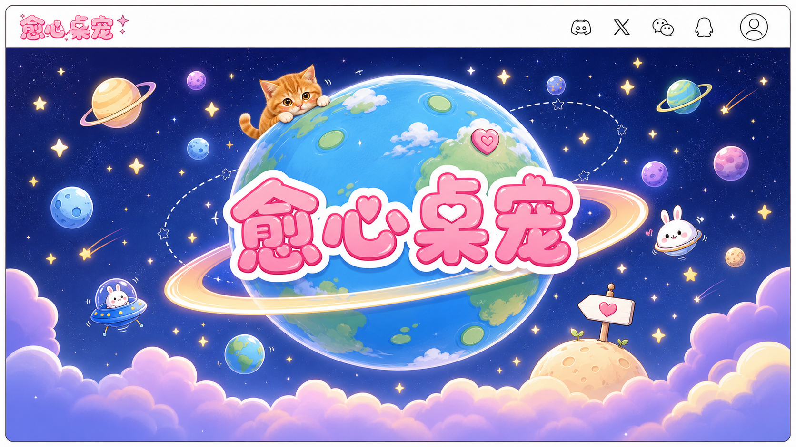

# 愈心桌宠



愈心桌宠是一个基于 Tauri、React 和 PixiJS 的桌面宠物平台。它不是单个宠物的演示程序，而是一个可以持续扩展不同角色包的桌宠应用：每只宠物都作为独立 package 放在 `public/pets/<pet-id>/` 下，由平台统一加载、渲染和交互。

## 主要功能

- 透明、置顶、无边框的桌面宠物窗口。
- 基于 PixiJS 的精灵图动画播放。
- 支持单击、双击、拖拽、悬停、桌面图标互动等交互。
- 支持护眼、喝水、吃饭、睡觉等陪伴提醒。
- 支持宠物包自带动画、对话、声音和预览资源。
- 预留应用内更新检查入口。

## 技术栈

- Tauri 2
- React 19
- PixiJS 8
- Vite
- TypeScript
- Vitest

## 本地开发

先安装前端依赖：

```powershell
npm install
```

启动浏览器预览：

```powershell
npm run dev
```

启动 Tauri 桌面应用：

```powershell
npm run tauri dev
```

## 常用命令

```powershell
npm test
npm run build
npm run tauri build
```

如果修改了 Tauri/Rust 侧代码，也建议在 `src-tauri` 下执行：

```powershell
cargo test
cargo check
```

## 宠物包

内置宠物通过 `public/pets/index.json` 注册。每个宠物包都放在独立目录中，目录名需要和 `pet.json` 里的 `id` 保持一致。

当前内置宠物：

- `xiaoju-cat`
- `ikun`
- `ds`
- `suan-bird`

最小宠物包结构：

```text
public/pets/index.json
public/pets/<pet-id>/
  pet.json
  spritesheet.webp
  preview.png
  README.md
```

`pet.json` 中的资源路径必须是相对当前宠物包目录的路径，不要使用绝对 Windows 路径，也不要把宠物素材放到 `src/`、`src-tauri/`、`dist/`、`releases/` 等平台目录里。

## 项目结构

```text
public/pets/        宠物包和宠物注册表
src/pet-core/       宠物加载、动画、交互、声音、对话等核心逻辑
src/platform-mail/  平台邮件和信件体验
src/pet-update/     更新检查入口
src-tauri/          Tauri 桌面壳、窗口和系统能力
docs/               设计文档和开发说明
releases/           本地构建产物
```

## 开发约定

- 平台代码和宠物内容保持分离。
- 宠物专属命名、文案、图片、声音、提示词和 QA 记录放在对应宠物包内。
- 共享渲染、交互、加载和安全校验逻辑放在 `src/`。
- 添加或调整宠物资源加载行为时，更新对应测试并至少运行相关测试和构建。

更多桌宠包规范见 [AGENTS.md](AGENTS.md)。
