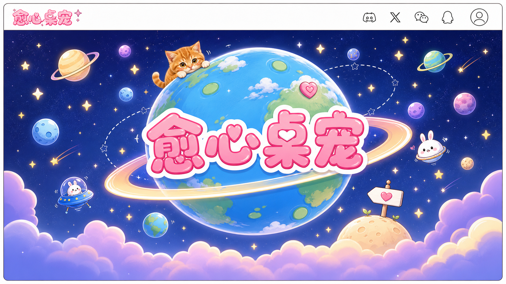

# 愈心桌宠



愈心桌宠是一个基于 Tauri、React 和 PixiJS 的桌面宠物平台。它不是单个宠物的演示程序，而是一个可以持续扩展不同角色包的桌宠应用：每只宠物都作为独立 package 放在 `public/pets/<pet-id>/` 下，由平台统一加载、渲染和交互。

## 主要功能

- 透明、置顶、无边框的桌面宠物窗口。
- 基于 PixiJS 的精灵图动画播放。
- 支持单击、双击、拖拽、悬停、桌面图标互动等交互。
- 支持护眼、喝水、吃饭、睡觉等陪伴提醒。
- 支持待办快速创建、完整编辑、今日视图、重复提醒、系统通知操作、回收站与本地统计。
- Windows 可为未触发提醒注册后台唤醒任务；应用内提醒与系统通知共享同一提醒实例。
- 支持宠物包自带动画、对话、声音和预览资源。
- 预留应用内更新检查入口。

## 技术栈

- Tauri 2
- React 19
- PixiJS 8
- Vite
- TypeScript
- Vitest

## 本地开发

先安装前端依赖：

```powershell
npm install
```

启动浏览器预览：

```powershell
npm run dev
```

启动 Tauri 桌面应用：

```powershell
npm run tauri dev
```

## 常用命令

```powershell
npm test
npm run build
npm run tauri build
```

如果修改了 Tauri/Rust 侧代码，也建议在 `src-tauri` 下执行：

```powershell
cargo test
cargo check
```

## 陪伴 Harness V1 当前边界

陪伴聊天的主动发送入口由 `src/pet-core/companionAppHarness.ts` 组合，领域操作仍由本机确定性 Task/Reminder、Preference、Memory 和主动提醒服务完成。可本地完成的明确操作不调用远程 Provider；用户主动配置远程 Provider 后，普通回合最多一次远程请求，允许时最多一次已披露的本地降级。

Phase 8-R2 的自动化证据位于 [`companionPhase8Acceptance.test.ts`](src/pet-core/companionPhase8Acceptance.test.ts)、[`companionObservability.test.ts`](src/pet-core/companionObservability.test.ts) 与 [`companionUserProfileSync.test.ts`](src/pet-core/companionUserProfileSync.test.ts)：观测数据只包含 allowlist 字段、opaque id、延迟、调用次数、动作/事件结果和安全错误类别，不包含完整 Prompt、消息、Task/Reminder、Memory、Provider body、回复正文或凭据；`global.nickname` Preference 是昵称唯一持久化事实源，Profile 昵称只是可恢复的显示镜像。Profile/Preference 联合保存使用可恢复的 prepared/committed 本地记录，启动先处理未完成事务，Preference key 存在但无昵称时不会复活旧 Profile。Recorder 失败不会改变领域成功、失败、取消或提交结果。正式数据边界见 [`agent-memory-data-contract.md`](docs/agent-memory-data-contract.md)。

当前 Tauri debug 窗口和 Web 构建可以单独验证，但本机尚未取得完整平台聊天的 Tauri 端到端证据；真实远程 Provider 冒烟、打包、发布和用户视觉验收也不因自动化通过而视为完成。

## 宠物包

内置宠物通过 `public/pets/index.json` 注册。每个宠物包都放在独立目录中，目录名需要和 `pet.json` 里的 `id` 保持一致。

当前内置宠物：

- `xiaoju-cat`
- `ikun`
- `ds`
- `suan-bird`

最小宠物包结构：

```text
public/pets/index.json
public/pets/<pet-id>/
  pet.json
  spritesheet.png
  preview.png
  README.md
```

`pet.json` 中的资源路径必须是相对当前宠物包目录的路径，不要使用绝对 Windows 路径，也不要把宠物素材放到 `src/`、`src-tauri/`、`dist/`、`releases/` 等平台目录里。

## 项目结构

```text
public/pets/        宠物包和宠物注册表
src/pet-core/       宠物加载、动画、交互、声音、对话等核心逻辑
src/account/        账号原型、Firebase 邮箱验证和本地预览兼容层
src/task-core/      待办、重复提醒、查询、设置与操作界面
src/platform-mail/  平台邮件和信件体验
src/pet-update/     更新检查入口
src-tauri/          Tauri 桌面壳、窗口和系统能力
docs/               设计文档和开发说明
releases/           本地构建产物
```

### Firebase 邮箱账号（可选）

账号入口为 `/account`。未配置 Firebase 环境变量时，账号页继续使用本地预览账号；配置完整后，注册和登录会切换到 Firebase Authentication 的 Email/Password，并要求用户完成邮箱验证。

复制 `.env.example` 为 `.env.local`，填入 Firebase 控制台中 Web App 的配置。`.env.local` 已被 Git 忽略，不要提交真实配置文件。

当前实现使用 `sendEmailVerification()`，不启用短信验证码。Firebase Spark 方案的邮箱地址验证邮件配额和账号限制以官方页面为准；如需使用自定义发件域名，应在 Firebase Authentication 的“电子邮件模板”中验证域名并按控制台提示添加 DNS 记录。

## 开发约定

- 平台代码和宠物内容保持分离。
- 宠物专属命名、文案、图片、声音、提示词和 QA 记录放在对应宠物包内。
- 共享渲染、交互、加载和安全校验逻辑放在 `src/`。
- 添加或调整宠物资源加载行为时，更新对应测试并至少运行相关测试和构建。

更多桌宠包规范见 [AGENTS.md](AGENTS.md)。
