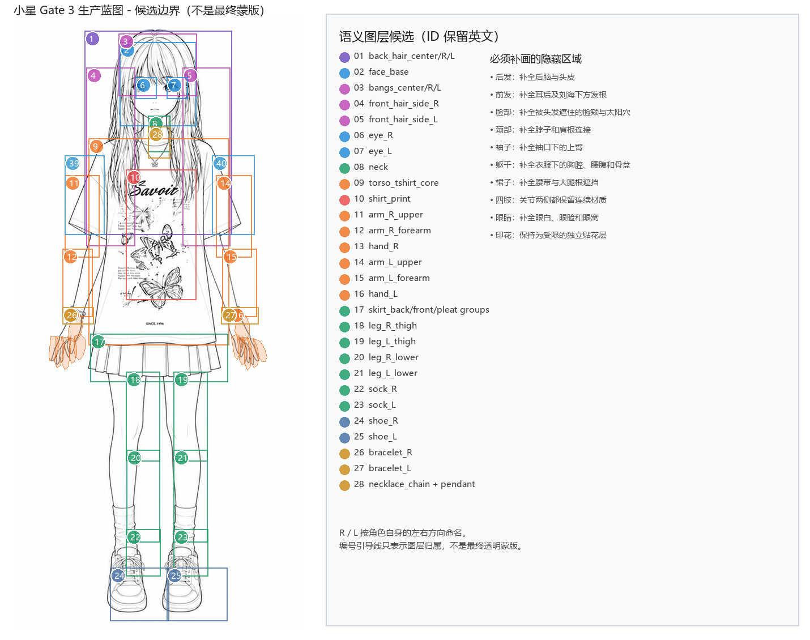

# Gate 3：小星正面生产母稿与语义拆件蓝图

## 当前决策

Gate 2A 和 Gate 2B 已由用户确认。本轮已冻结一张坐标锁定的正面彩色目标和对应线稿候选，
并建立了 62 个语义层的候选表。手部曾进行手指扇和逐指实验；用户明确首版没有握拳或手势动作后，
当前合同收敛为左右完整手各一层、左右手链独立，
并把左右腕饰独立出来。当前状态为 **等待用户确认 Gate 3 蓝图**；还没有生成正式透明
部件、隐藏纹理、ArtMesh 或 Cubism 模型。

## 同坐标母稿

- 彩色目标：[gate3-color-target-v1.png](../source/masters/gate3-color-target-v1.png)
- 生产线稿候选：[gate3-line-master-candidate-v1.png](../source/masters/gate3-line-master-candidate-v1.png)
- 原图裁剪：源图 `(x=34, y=0, width=512, height=1086)`
- 回源变换：`x_source = x_master + 34`，`y_source = y_master`
- 缩放：`1.0`；未对彩稿和线稿做独立缩放或手工错位

这两张母稿仍保留白色背景和扁平合成状态，作用是锁定身份、比例、构图和语义边界，
不是可直接导入 Cubism 的透明素材。

## 语义边界

蓝图包括：

- 后发、刘海、左右前侧发
- 脸、双耳、眉毛、鼻子和嘴
- 左右眼的 socket、sclera、iris、pupil、highlight、上下眼睑和 clipping mask
- 颈部、T 恤、胸前印花、裙子
- 左右上臂、前臂、手掌、逐根手指和独立腕饰
- 左右大腿、小腿、袜子和鞋
- 隐藏身体底层、项链和饰品

材料分离复审又补上了最容易在动起来后穿帮的层：后发中心/左右尾束、刘海中心/左右组、左右袖子、
裙子后层/前中/左右褶组、项链链条/吊坠，以及嘴腔/上下唇线/舌面。袖子不再并入 T 恤主体，左右侧发
也不再共用一个材质层。

眼睛没有被当成“两个平移瞳孔”。每只眼睛都预留独立眼窝、眼白、虹膜、瞳孔、高光、上下眼睑
和遮罩职责，符合文章中“顶点/纹理/图层独立控制”的原则，也符合 Live2D 眨眼与视线的连续变形要求。

## 隐藏补画优先级

1. 后脑、头皮、耳后和被前发覆盖的脸侧
2. 颈部、肩根、袖口下完整上臂
3. T 恤下的胸腔、腰腹、骨盆与裙腰
4. 四肢在裙子、袖子、袜口和鞋口下的连续材质
5. 眼窝、眼睑闭合区域和嘴部内部
6. 胸前印花的独立受限层

不得使用圆形补丁、克隆纹理、默认遮挡或整姿势图片来掩盖这些区域。

## 绘制顺序与节点树

机器可读合同：[gate3-production-blueprint-contract.json](../blueprints/gate3-production-blueprint-contract.json)

绘制顺序从后到前；节点树与绘制顺序分开维护。每个真实活动层只有一个主节点，
父节点变换向子节点传递，避免把一层绑定到多个互相冲突的父节点。

## 视觉审阅板

手部局部审阅：[gate3-hand-simple-alignment-qa.png](../qa/gate3-hand-simple-alignment-qa.png)。当前手部采用
左右完整手各一层，所有手指保持原图姿态；只在腕部做轻微跟随，手链独立，不制作逐指参数。

用户反馈初版手部矩形存在漏覆盖与过覆盖后，已改为闭合多边形轮廓，并修正总审阅板上遗漏的
`(24, 24)` 母稿粘贴偏移。手部候选多边形现在保存在机器可读合同的
`handSegmentation.candidatePolygonsSourceMaster` 中。

再次复核“没有对齐”的反馈后，左右手已改为分别描定，不再镜像复用；并增加
[像素对齐审阅板](../qa/gate3-hand-pixel-alignment-qa.png)。该板把语义分区裁切到每只手独立提取的
真实皮肤连通域：左右手覆盖率均为 `1.000`，未覆盖与重叠均为 `0 px`。这证明当前预览没有外轮廓
漏盖或越界；当前完整手层不存在手指之间的语义切线，避免无动作收益的额外维护成本。

审阅板中的编号引导是语义所有权候选，不是最终 alpha mask。真正的 mask 必须在用户确认后，
从这张锁定线稿中逐层导出，再用同一彩色目标填充材质。

## Gate 3 门禁

- [x] Gate 2A 三视图身份与统一身体通过
- [x] Gate 2B 待机支撑与连续性通过
- [x] 同坐标彩色目标与线稿候选
- [x] 62 层语义所有权、父节点、pivot、draw order 草案
- [x] 手部完整层与独立腕饰方案
- [x] 眼睛独立材料与遮罩职责
- [ ] 用户确认生产母稿构图和语义边界
- [ ] 导出 full-canvas 二值 mask
- [ ] 平面颜色重建通过
- [ ] 纹理填充与隐藏材质通过
